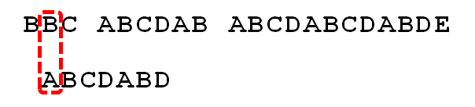
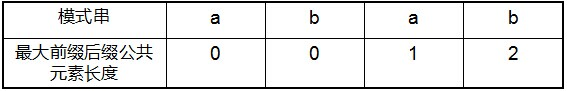
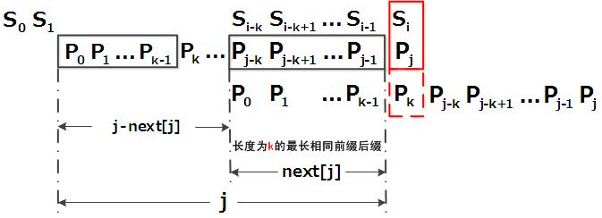
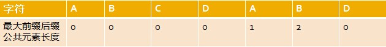
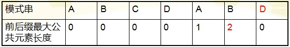
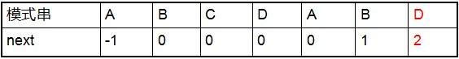

# kmp之前，暴力匹配算法

**暴力匹配算法**
    假设现在我们面临这样一个问题：有一个文本串S，和一个模式串P，现在要查找P在S中的位置，怎么查找呢？

    如果用暴力匹配的思路，并假设现在文本串S匹配到 i 位置，模式串P匹配到 j 位置，则有：

<span style="color: green">如果当前字符匹配成功（即S[i] == P[j]），则i++，j++，继续匹配下一个字符；
如果失配（即S[i]! = P[j]），令i = i - (j - 1)，j = 0。相当于每次匹配失败时，i 回溯，j 被置为0。

理清楚了暴力匹配算法的流程及内在的逻辑，咱们可以写出暴力匹配的代码，如下：
```cpp
int ViolentMatch(char* s, char* p)
{
	int sLen = strlen(s);
	int pLen = strlen(p);
 
	int i = 0;
	int j = 0;
	while (i < sLen && j < pLen)
	{
		if (s[i] == p[j])
		{
			//①如果当前字符匹配成功（即S[i] == P[j]），则i++，j++    
			i++;
			j++;
		}
		else
		{
			//②如果失配（即S[i]! = P[j]），令i = i - (j - 1)，j = 0    
			i = i - j + 1;
			j = 0;
		}
	}
	//匹配成功，返回模式串p在文本串s中的位置，否则返回-1
	if (j == pLen)
		return i - j;
	else
		return -1;
}
```
<span style="color:green">举个例子，如果给定文本串S“BBC ABCDAB ABCDABCDABDE”，和模式串P“ABCDABD”，现在要拿模式串P去跟文本串S匹配，整个过程如下所示：

1. S[0]为B，P[0]为A，不匹配，执行第②条指令：“如果失配（即S[i]! = P[j]），令i = i - (j - 1)，j = 0”，S[1]跟P[0]匹配，相当于模式串要往右移动一位（i=1，j=0）


 2. S[1]跟P[0]还是不匹配，继续执行第②条指令：“如果失配（即S[i]! = P[j]），令i = i - (j - 1)，j = 0”，S[2]跟P[0]匹配（i=2，j=0），从而模式串不断的向右移动一位（不断的执行“令i = i - (j - 1)，j = 0”，i从2变到4，j一直为0）


3. 直到S[4]跟P[0]匹配成功（i=4，j=0），此时按照上面的暴力匹配算法的思路，转而执行第①条指令：“如果当前字符匹配成功（即S[i] == P[j]），则i++，j++”，可得S[i]为S[5]，P[j]为P[1]，即接下来S[5]跟P[1]匹配（i=5，j=1）


4. S[5]跟P[1]匹配成功，继续执行第①条指令：“如果当前字符匹配成功（即S[i] == P[j]），则i++，j++”，得到S[6]跟P[2]匹配（i=6，j=2），如此进行下去


5. 直到S[10]为空格字符，P[6]为字符D（i=10，j=6），因为不匹配，重新执行第②条指令：“如果失配（即S[i]! = P[j]），令i = i - (j - 1)，j = 0”，相当于S[5]跟P[0]匹配（i=5，j=0）


 6. 至此，我们可以看到，如果按照暴力匹配算法的思路，尽管之前文本串和模式串已经分别匹配到了S[9]、P[5]，但因为S[10]跟P[6]不匹配，所以文本串回溯到S[5]，模式串回溯到P[0]，从而让S[5]跟P[0]匹配。


而S[5]肯定跟P[0]失配。为什么呢？因为在之前第4步匹配中，我们已经得知S[5] = P[1] = B，而P[0] = A，即P[1] != P[0]，故S[5]必定不等于P[0]，所以回溯过去必然会导致失配。那有没有一种算法，让i 不往回退，只需要移动j 即可呢？

<span style="color: green">答案是肯定的。这种算法就是本文的主旨KMP算法，它利用之前已经部分匹配这个有效信息，保持i 不回溯，通过修改j 的位置，让模式串尽量地移动到有效的位置。

最坏时间复杂度：n*m
n是文本串长，m是模式串长

接下来，我们介绍一种线性时间复杂度n的算法，核心思想是模式串位置不后退

#  KMP算法
定义
<span style="color: green">Knuth-Morris-Pratt 字符串查找算法，简称为 “KMP算法”，常用于在一个文本串S内查找一个模式串P 的出现位置，这个算法由Donald Knuth、Vaughan Pratt、James H. Morris三人于1977年联合发表，故取这3人的姓氏命名此算法。

<span style="color: white">下面先直接给出KMP的算法流程（如果感到一点点不适，没关系，坚持下，稍后会有具体步骤及解释，越往后看越会柳暗花明☺）：

<span style="color: green">假设现在文本串S匹配到 i 位置，模式串P匹配到 j 位置
如果j = -1，或者当前字符匹配成功（即S[i] == P[j]），都令i++，j++，继续匹配下一个字符；
如果j != -1，且当前字符匹配失败（即S[i] != P[j]），则令 i 不变，j = next[j]。此举意味着失配时，模式串P相对于文本串S向右移动了j - next [j] 位。
换言之，当匹配失败时，模式串向右移动的位数为：失配字符所在位置 - 失配字符对应的next 值（next 数组的求解会在下文的3.3.3节中详细阐述），即移动的实际位数为：j - next[j]，且此值大于等于1。
很快，你也会意识到next 数组各值的含义：代表当前字符之前的字符串中，有多大长度的相同前缀后缀。例如如果next [j] = k，代表j 之前的字符串中有最大长度为k 的相同前缀后缀。

<span style="color: white">此也意味着在某个字符失配时，该字符对应的next 值会告诉你下一步匹配中，模式串应该跳到哪个置（跳到next [j] 的位置）。如果next [j] 等于0或-1，则跳到模式串的开头字符，若next [j]= k 且 k > 0，代表下次匹配跳到j 之前的某个字符，而不是跳到开头，且具体跳过了k 个字符。

<span style="color: green">转换成代码表示，则是：

```cpp
int KmpSearch(char* s, char* p)
{
	int i = 0;
	int j = 0;
	int sLen = strlen(s);
	int pLen = strlen(p);
	while (i < sLen && j < pLen)
	{
		//①如果j = -1，或者当前字符匹配成功（即S[i] == P[j]），都令i++，j++    
		if (j == -1 || s[i] == p[j])
		{
			i++;
			j++;
		}
		else
		{
			//②如果j != -1，且当前字符匹配失败（即S[i] != P[j]），则令 i 不变，j = next[j]    
			//next[j]即为j所对应的next值      
			j = next[j];
		}
	}
	if (j == pLen)
		return i - j;
	else
		return -1;
}
```
继续拿之前的例子来说，当S[10]跟P[6]匹配失败时，KMP不是跟暴力匹配那样简单的把模式串右移一位，而是执行第②条指令：“如果j != -1，且当前字符匹配失败（即S[i] != P[j]），则令 i 不变，j = next[j]”，即j 从6变到2（后面我们将求得P[6]，即字符D对应的next 值为2），所以相当于模式串向右移动的位数为j - next[j]（j - next[j] = 6-2 = 4）。


向右移动4位后，S[10]跟P[2]继续匹配。为什么要向右移动4位呢，因为移动4位后，模式串中又有个“AB”可以继续跟S[8]S[9]对应着，从而不用让i 回溯。相当于在除去字符D的模式串子串中寻找相同的前缀和后缀，然后根据前缀后缀求出next 数组，最后基于next 数组进行匹配（不关心next 数组是怎么求来的，只想看匹配过程是咋样的，可直接跳到下文3.3.4节）。


3.2 步骤
①寻找前缀后缀最长公共元素长度
对于P = p0 p1 ...pj-1 pj，寻找模式串P中长度最大且相等的前缀和后缀。如果存在p0 p1 ...pk-1 pk = pj- k pj-k+1...pj-1 pj，那么在包含pj的模式串中有最大长度为k+1的相同前缀后缀。举个例子，如果给定的模式串为“abab”，那么它的各个子串的前缀后缀的公共元素的最大长度如下表格所示：


③根据next数组进行匹配
匹配失配，j = next [j]，模式串向右移动的位数为：j - next[j]。换言之，当模式串的后缀pj-k pj-k+1, ..., pj-1 跟文本串si-k si-k+1, ..., si-1匹配成功，但pj 跟si匹配失败时，因为next[j] = k，相当于在不包含pj的模式串中有最大长度为k 的相同前缀后缀，即p0 p1 ...pk-1 = pj-k pj-k+1...pj-1，故令j = next[j]，从而让模式串右移j - next[j] 位，使得模式串的前缀p0 p1, ..., pk-1对应着文本串 si-k si-k+1, ..., si-1，而后让pk 跟si 继续匹配。如下图所示：



 综上，KMP的next 数组相当于告诉我们：当模式串中的某个字符跟文本串中的某个字符匹配失配时，模式串下一步应该跳到哪个位置。如模式串中在j 处的字符跟文本串在i 处的字符匹配失配时，下一步用next [j] 处的字符继续跟文本串i 处的字符匹配，相当于模式串向右移动 j - next[j] 位。

    接下来，分别具体解释上述3个步骤。

3.3 解释
3.3.1 寻找最长前缀后缀

如果给定的模式串是：“ABCDABD”，从左至右遍历整个模式串，其各个子串的前缀后缀分别如下表格所示：


 也就是说，原模式串子串对应的各个前缀后缀的公共元素的最大长度表为（下简称《最大长度表》）：

3.3.2 基于《最大长度表》匹配

因为模式串中首尾可能会有重复的字符，故可得出下述结论：

**失配时，模式串向右移动的位数为：已匹配字符数 - 失配字符的上一位字符所对应的最大长度值**

下面，咱们就结合之前的《最大长度表》和上述结论，进行字符串的匹配。如果给定文本串“BBC ABCDAB ABCDABCDABDE”，和模式串“ABCDABD”，现在要拿模式串去跟文本串匹配，如下图所示：


1. 因为模式串中的字符A跟文本串中的字符B、B、C、空格一开始就不匹配，所以不必考虑结论，直接将模式串不断的右移一位即可，直到模式串中的字符A跟文本串的第5个字符A匹配成功：


2. 继续往后匹配，当模式串最后一个字符D跟文本串匹配时失配，显而易见，模式串需要向右移动。但向右移动多少位呢？因为此时已经匹配的字符数为6个（ABCDAB），然后根据《最大长度表》可得失配字符D的上一位字符B对应的长度值为2，所以根据之前的结论，可知需要向右移动6 - 2 = 4 位。


3. 模式串向右移动4位后，发现C处再度失配，因为此时已经匹配了2个字符（AB），且上一位字符B对应的最大长度值为0，所以向右移动：2 - 0 =2 位
   


4. A与空格失配，向右移动1 位
   


5. 继续比较，发现D与C 失配，故向右移动的位数为：已匹配的字符数6减去上一位字符B对应的最大长度2，即向右移动6 - 2 = 4 位。


6. 经历第5步后，发现匹配成功，过程结束。


 通过上述匹配过程可以看出，问题的关键就是寻找模式串中最大长度的相同前缀和后缀，找到了模式串中每个字符之前的前缀和后缀公共部分的最大长度后，便可基于此匹配。而这个最大长度便正是next 数组要表达的含义。

3.3.3 根据《最大长度表》求next 数组

由上文，我们已经知道，字符串“ABCDABD”各个前缀后缀的最大公共元素长度分别为：


而且，根据这个表可以得出下述结论

失配时，模式串向右移动的位数为：已匹配字符数 - 失配字符的上一位字符所对应的最大长度值
    上文利用这个表和结论进行匹配时，我们发现，当匹配到一个字符失配时，其实没必要考虑当前失配的字符，更何况我们每次失配时，都是看的失配字符的上一位字符对应的最大长度值。如此，便引出了next 数组。

    给定字符串“ABCDABD”，可求得它的next 数组如下：



 把next 数组跟之前求得的最大长度表对比后，不难发现，next 数组相当于“最大长度值” 整体向右移动一位，然后初始值赋为-1。意识到了这一点，你会惊呼原来next 数组的求解竟然如此简单：就是找最大对称长度的前缀后缀，然后整体右移一位，初值赋为-1（当然，你也可以直接计算某个字符对应的next值，就是看这个字符之前的字符串中有多大长度的相同前缀后缀）。

    换言之，对于给定的模式串：ABCDABD，它的最大长度表及next 数组分别如下：


根据最大长度表求出了next 数组后，从而有

**失配时，模式串向右移动的位数为：失配字符所在位置 - 失配字符对应的next 值**

而后，你会发现，无论是基于《最大长度表》的匹配，还是基于next 数组的匹配，两者得出来的向右移动的位数是一样的。为什么呢？因为：

根据《最大长度表》，失配时，模式串向右移动的位数 = 已经匹配的字符数 - 失配字符的上一位字符的最大长度值
而根据《next 数组》，失配时，模式串向右移动的位数 = 失配字符的位置 - 失配字符对应的next 值
其中，从0开始计数时，失配字符的位置 = 已经匹配的字符数（失配字符不计数），而失配字符对应的next 值 = 失配字符的上一位字符的最大长度值，两相比较，结果必然完全一致。
    所以，你可以把《最大长度表》看做是next 数组的雏形，甚至就把它当做next 数组也是可以的，区别不过是怎么用的问题。

3.3.4 通过代码递推计算next 数组

    接下来，咱们来写代码求下next 数组。

    基于之前的理解，可知计算next 数组的方法可以采用递推：

 如果对于值k，已有p0 p1, ..., pk-1 = pj-k pj-k+1, ..., pj-1，相当于next[j] = k。
此意味着什么呢？究其本质，next[j] = k 代表p[j] 之前的模式串子串中，有长度为k 的相同前缀和后缀。有了这个next 数组，在KMP匹配中，当模式串中j 处的字符失配时，下一步用next[j]处的字符继续跟文本串匹配，相当于模式串向右移动j - next[j] 位。

举个例子，如下图，根据模式串“ABCDABD”的next 数组可知失配位置的字符D对应的next 值为2，代表字符D前有长度为2的相同前缀和后缀（这个相同的前缀后缀即为“AB”），失配后，模式串需要向右移动j - next [j] = 6 - 2 =4位。


向右移动4位后，模式串中的字符C继续跟文本串匹配。


